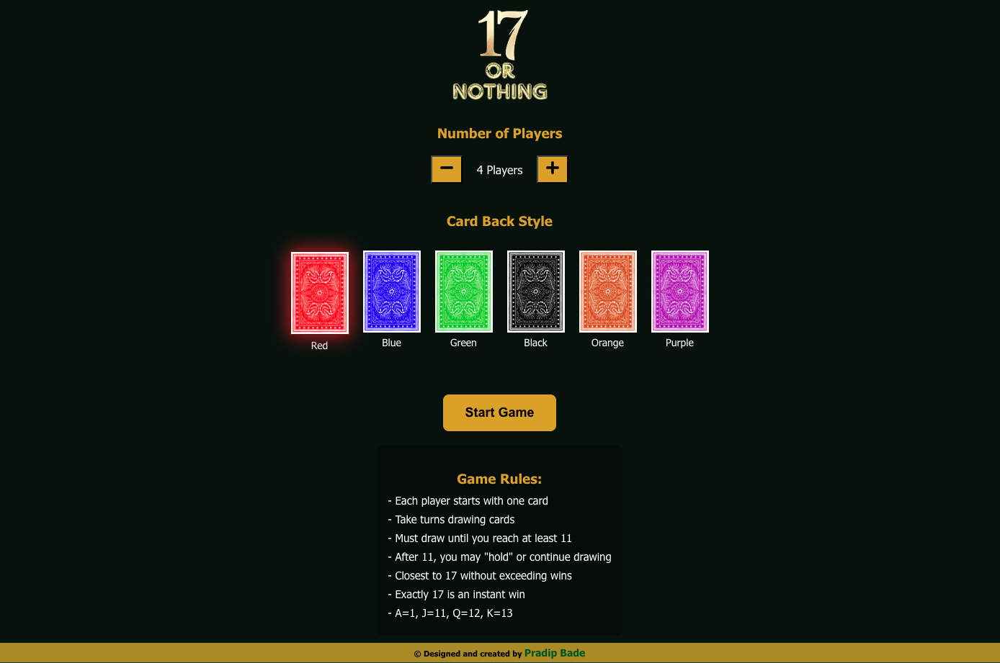
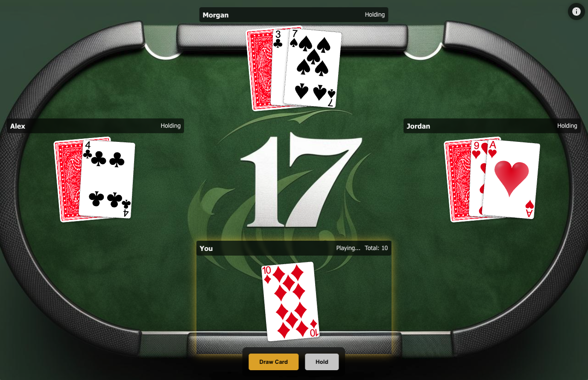
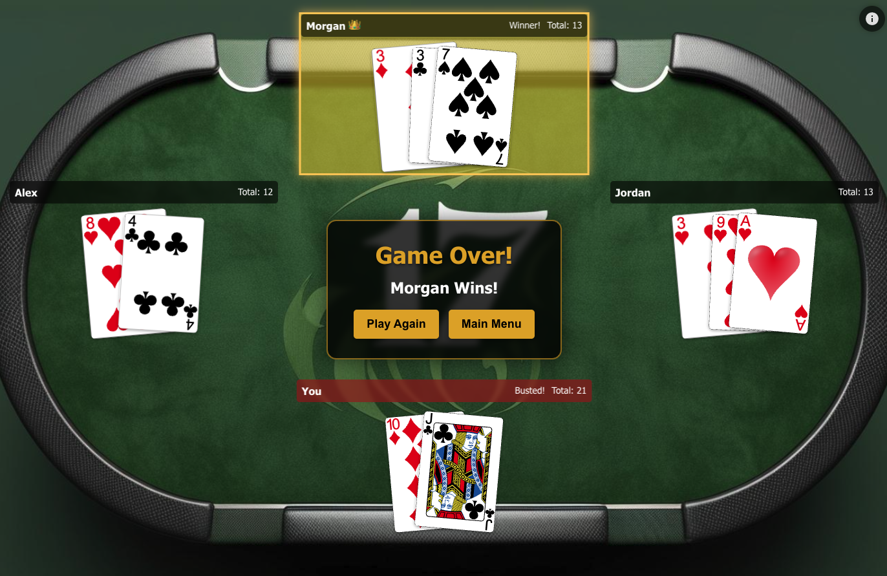
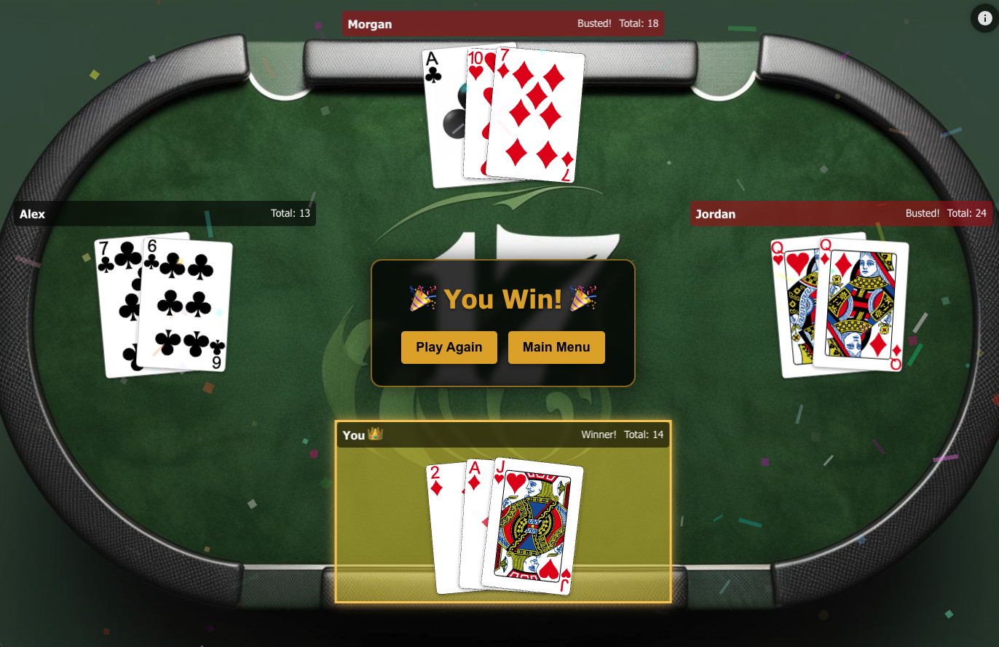

# 17 or Nothing - Card Game

A React-based card game where players draw cards aiming to get closest to 17 without going over.

## Overview

"17 or Nothing" is an interactive card game where you compete against AI players. The objective is to get as close to 17 as possible without exceeding it. The player with exactly 17 or closest to it wins.

## Features

- **Interactive Card Game**: Draw cards and compete against 2-6 AI opponents
- **Responsive Design**: Play on desktop or mobile devices, but better experience in PC
- **Sound Effects**: Immersive audio feedback for game actions
- **Multiple Card Back Styles**: Choose from 6 different card back designs
- **Persistent Settings**: Game remembers your preferences
- **Celebration Effects**: Special effects when you win

## How to Play

1. **Setup**: Select the number of players (2-6) and your preferred card back design
2. **Gameplay**: 
   - Each player starts with one card
   - On your turn, choose to either "Draw" or "Hold"
   - You must draw until you have at least 11 points
   - Try to get as close to 17 as possible without going over
   - If you exceed 17, you're eliminated
3. **Winning**: The player closest to 17 (or with exactly 17) wins the game

## Game Rules

- All players start with one card
- Must draw until reaching at least 11 points
- Can hold at any point after reaching 11
- Ace=1, Jack=11, Queen=12, King=13
- If you exceed 17, you're eliminated
- Getting exactly 17 is an instant win

## Technologies Used

- React.js
- CSS3 with animations
- Local Storage for persistence
- Custom hooks for game logic
- React Router for navigation

## Installation and Running Locally

1. Clone the repository:

   git clone https://github.com/pradipbade7/card-games.git

2. Navigate to the project directory:
   cd card-games

3. Install dependencies:
   npm install

4. Start the development server:
   npm start

5. Open your browser and visit:
   http://localhost:3000

## Gameplay Screenshots

*Player selects the number of opponents and card back design*

*In-game screen with cards and player controls*

*Screen when bot wins*

*Celebration screen when player wins*

## Future Enhancements

- Multiplayer support
- Additional card games
- Customizable difficulty levels
- Player statistics and achievements
- Additional visual themes

## Credits

- Card assets: [Playing Cards by Byron Knoll](https://code.google.com/archive/p/vector-playing-cards/)
- Sound effects: Various free sources including [Freesound](https://freesound.org/)
- Game concept inspired by various card games with a unique twist

## License

MIT License - See LICENSE file for details.